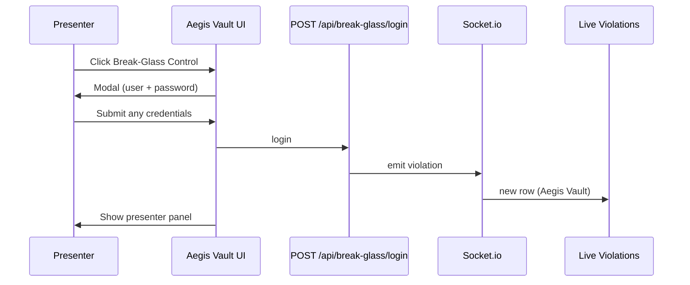

## Context

Aegis Vault’s left sidebar has a red **Demo Control** entry that opens the presenter firewall console (`DemoControlPanel`). Live violations today come only from `SYS.DBA_SQL_FIREWALL_VIOLATIONS` via the status poller. Presenters need a break-glass login moment that appears instantly in **Live Violations** with audience-friendly labels (**Aegis Vault**, **Break-Glass Logged in**) without depending on LuminaForge attacks or Oracle dictionary writes.

## Goals / Non-Goals

**Goals:**
- Rename nav label to **Break-Glass Control**.
- Centered modal on section select: Break-Glass User + Password (demo: any values accepted if fields are non-empty).
- One synthetic violation per successful login, visible in Live Violations / Threat Feed within the same WebSocket cycle.
- Field mapping exactly as specified by the presenter script.

**Non-Goals:**
- Real authentication, password storage, or Oracle `DBA_SQL_FIREWALL_VIOLATIONS` inserts.
- Removing firewall demo buttons (global / LuminaForge control center)—they remain after break-glass login.
- LuminaForge or SQL Firewall policy changes.

## Decisions

### Decision 1 — Nav and section id

| Item | Value |
|---|---|
| Sidebar label | `Break-Glass Control` |
| `NavSection` id | `break-glass-control` (rename from `demo-control`) |
| Center panel | Existing `DemoControlPanel` after modal success |

Clicking **Break-Glass Control** sets `section === "break-glass-control"` and opens the modal. If the user already completed break-glass login in this browser session, skip modal and show the panel directly (session flag in React state).

### Decision 2 — Synthetic `FirewallViolation` shape

Extend `FirewallViolation.source_app` union and add display support:

```ts
source_app: "AEGIS_APP" | "luminaforge" | "Aegis Vault";
```

Factory in `lib/break-glass.ts`:

```ts
export function createBreakGlassViolation(username: string): FirewallViolation {
  const occurred_at = new Date().toISOString();
  return {
    id: `break-glass|${occurred_at}|${username}`,
    username: username.trim(),
    source_app: "Aegis Vault",
    sql_text: "N/A",
    occurred_at,
    detected_at: occurred_at,
    violation_type: "BREAK_GLASS",
    action_label: "Break-Glass Logged in",
    firewall_action: undefined,
  };
}
```

| UI column | Field |
|---|---|
| Time | `occurred_at` |
| Source App | `source_app` → renders `Aegis Vault` |
| User | `username` |
| Type | `violation_type` → `BREAK_GLASS` (full views) |
| Action | `action_label` → `Break-Glass Logged in` |
| SQL | `sql_text` → `N/A` |

Password is **not** logged (demo narrative: credentials verified locally only).

### Decision 2b — Compact right-rail **Live Violations** (3 columns)

After `aegis-live-violations-compact`, the right aside shows only **Time · Source App · Type**. Break-glass rows SHALL map as:

| Compact column | Break-glass value |
|---|---|
| Time | `occurred_at` (current time) |
| Source App | `Aegis Vault` |
| Type | `Break-Glass Logged in` (render `action_label` in the Type cell for `source_app === "Aegis Vault"`) |

**User** and **SQL** remain in the violation object for **Threat Feed** / **Violations** full tables (`variant="full"`); they are not shown on the compact right rail.

### Decision 3 — Server memory + poll merge

Problem: `violations-snapshot` from the poller replaces client state and would drop client-only rows.

Solution: in-memory ring buffer on the server (max ~50 break-glass events per process):

```
lib/break-glass-store.ts
  push(violation)
  list() → FirewallViolation[]
```

In `runPollCycle`:
1. Fetch Oracle violations as today.
2. `merged = [...breakGlassStore.list(), ...dbViolations]` dedupe by `id`, sort by `occurred_at` desc, cap at poll limit.
3. Emit `violations-snapshot` and per-new `violation` for DB rows only (unchanged); break-glass login route emits one immediate `violation` event.

`POST /api/break-glass/login`:

```ts
// body: { username: string, password: string }
// demo: require username.trim().length > 0; password ignored
const v = createBreakGlassViolation(username);
breakGlassStore.push(v);
emitViolation(io, v);  // via poller-registry helper
return NextResponse.json({ violation: v });
```

### Decision 4 — UI: `BreakGlassModal`

- Framer Motion or plain fixed overlay: `fixed inset-0 z-50 flex items-center justify-center bg-black/60`
- Glass panel card, two inputs, Submit / Cancel
- Submit → `fetch("/api/break-glass/login", { method: "POST", body: JSON.stringify({ username, password }) })`
- On success: close modal, set `breakGlassUnlocked = true`, prepend violation locally (redundant with socket but instant)
- `ViolationsTable`: style `source_app === "Aegis Vault"` with distinct accent (e.g. amber `#fbbf24`); compact Type cell shows `action_label` for break-glass rows

### Decision 5 — Modal trigger flow



## Risks / Trade-offs

- **Synthetic events lost on server restart** → Acceptable for demo; document in README.
- **Poll cap may push old break-glass rows off** → Ring buffer + merge sort keeps recent break-glass at top when newest.
- **Duplicate rows if user spams login** → Each login creates a new row (intended for demo replays).

## Open Questions

1. Should break-glass session reset on page refresh (modal shows again)? **Default: yes** (session state only in React).
2. Should Type column show `BREAK_GLASS` or stay blank? **Default: `BREAK_GLASS`** for SOC consistency.
